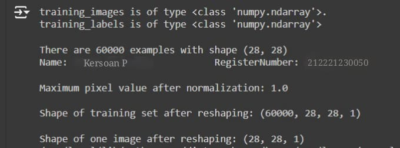

# Implementation-of-CNN

## AIM

To Develop a convolutional deep neural network for digit classification.

## Problem Statement and Dataset

## Neural Network Model


## DESIGN STEPS

### STEP 1:
Import the necessary libraries and Load the data set.
### STEP 2:
Reshape and normalize the data.
### STEP 3:
In the EarlyStoppingCallback change define the on_epoch_end funtion and define the necessary condition for accuracy
### STEP 4:
Train the model
## PROGRAM

### Name: Kersoan P
### Register Number: 212221230050
```python
import os
import base64
import numpy as np
import tensorflow as tf


# Append data/mnist.npz to the previous path to get the full path
data_path = "mnist.npz.zip"

# Load data (discard test set)
(training_images, training_labels), _ = tf.keras.datasets.mnist.load_data(path=data_path)

print(f"training_images is of type {type(training_images)}.\ntraining_labels is of type {type(training_labels)}\n")

# Inspect shape of the data
data_shape = training_images.shape

print(f"There are {data_shape[0]} examples with shape ({data_shape[1]}, {data_shape[2]})")
def reshape_and_normalize(images):
    """Reshapes the array of images and normalizes pixel values.

    Args:
        images (numpy.ndarray): The images encoded as numpy arrays

    Returns:
        numpy.ndarray: The reshaped and normalized images.
    """

    ### START CODE HERE ###

    # Reshape the images to add an extra dimension (at the right-most side of the array)
    images = images[..., np.newaxis]

    # Normalize pixel values
    images = images / 255.0

    ### END CODE HERE ###

    return images
# Reload the images in case you run this cell multiple times
(training_images, _), _ = tf.keras.datasets.mnist.load_data(path=data_path)

# Apply your function
training_images = reshape_and_normalize(training_images)
print('Name: Joyce Beulah R           RegisterNumber: 212222230058        \n')
print(f"Maximum pixel value after normalization: {np.max(training_images)}\n")
print(f"Shape of training set after reshaping: {training_images.shape}\n")
print(f"Shape of one image after reshaping: {training_images[0].shape}")
import tensorflow as tf

class EarlyStoppingCallback(tf.keras.callbacks.Callback):

    def on_epoch_end(self, epoch, logs=None):
        # Check if the accuracy is greater or equal to 0.995
        if logs.get('accuracy') >= 0.995:
            # Stop training once the above condition is met
            self.model.stop_training = True
            print("\nReached 99.5% accuracy so cancelling training!")
import tensorflow as tf

def convolutional_model():
    """Returns the compiled (but untrained) convolutional model.

    Returns:
        tf.keras.Model: The model which should implement convolutions.
    """

    ### START CODE HERE ###

    # Define the model
    model = tf.keras.models.Sequential([
        # Convolutional layer with 32 filters, 3x3 kernel size, and ReLU activation
        tf.keras.layers.Conv2D(32, (3, 3), activation='relu', input_shape=(28, 28, 1)),
        # Max pooling layer
        tf.keras.layers.MaxPooling2D((2, 2)),
        # Convolutional layer with 64 filters, 3x3 kernel size, and ReLU activation
        tf.keras.layers.Conv2D(64, (3, 3), activation='relu'),
        # Max pooling layer
        tf.keras.layers.MaxPooling2D((2, 2)),
        # Convolutional layer with 64 filters, 3x3 kernel size, and ReLU activation
        tf.keras.layers.Conv2D(64, (3, 3), activation='relu'),
        # Flatten layer to convert 2D outputs to 1D
        tf.keras.layers.Flatten(),
        # Dense layer with 64 units and ReLU activation
        tf.keras.layers.Dense(64, activation='relu'),
        # Output layer with 10 units (one for each class) and softmax activation
        tf.keras.layers.Dense(10, activation='softmax')
    ])
    ### END CODE HERE ###

    # Compile the model
    model.compile(
        optimizer='adam',
        loss='sparse_categorical_crossentropy',
        metrics=['accuracy']
    )

    return model
model = convolutional_model()
training_history = model.fit(training_images, training_labels, epochs=10, callbacks=[EarlyStoppingCallback()])

```
## OUTPUT
### Reshape and Normalize output



### Training the model output


## RESULT
Thus the program for developing a convolutional deep neural network for digit classification.

